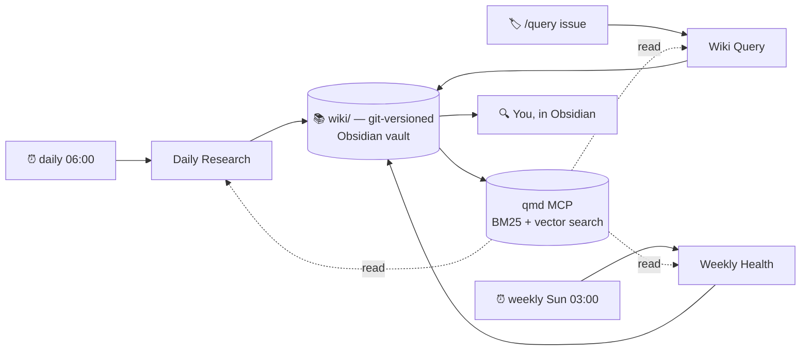

<div align="center">

# Wikipilot

**A research wiki that maintains itself.**

[](LICENSE)
[](https://www.python.org/downloads/)
[](#)
[](https://docs.anthropic.com/en/docs/claude-code/web-scheduled-tasks)
[](https://obsidian.md/)
[](#contributing)

_Inspired by [Karpathy's LLM Wiki](https://gist.github.com/karpathy/442a6bf555914893e9891c11519de94f). Powered by [Claude Code Cloud Routines](https://docs.anthropic.com/en/docs/claude-code/web-scheduled-tasks). Read in [Obsidian](https://obsidian.md/)._

</div>

---

> Most knowledge tools rot.
> **This one compounds.**

Every day, while you sleep, an Opus-class model reads the web for the topics you care about, drafts cited synthesis, cross-references it against everything you've already ingested, flags contradictions, and opens one pull request per topic for you to wake up to. Every week, a separate sweep re-reads what's been there a while and files disputes when the world has moved on. Every time you ask the wiki a question, an answer page lands in your repo, back-linked from every concept it touches, so the next question that grazes the same neighborhood already has the breadcrumbs.

There's no chat history. No RAG round-trip. No re-derivation. Just a markdown vault that gets denser, more cross-referenced, and more accurate every day — versioned in git, read in Obsidian, owned by you.

## The premise

LLMs are good at synthesis but bad at memory. The reflex of the last two years has been to staple them to vector databases and ask them to re-derive answers from raw documents on every query. That's expensive, lossy, and never compounds — the third question about transformer attention does the same work as the first.

[Andrej Karpathy's LLM Wiki gist](https://gist.github.com/karpathy/442a6bf555914893e9891c11519de94f) proposed the inversion: let the LLM maintain a **persistent, structured, cross-referenced wiki**, and treat that wiki as the substrate. Every source ingested triggers 10–15 page touches across concepts, entities, comparisons, and topics. Contradictions surface as `## Disputes` bullets instead of getting silently overwritten. Every claim is cited inline; every cited source has a verbatim `>` quote underneath as evidence. The synthesis is the artifact, not the chat log.

Wikipilot is one implementation of that idea, deliberately opinionated:

- **Schema-first.** Every page declares its `kind`, its citations, its freshness window. A 500-line Python lint blocks any agent edit that violates the schema, and the auto-merge gate refuses to land a PR with lint errors. Discipline scales; vibes don't.
- **Citation discipline.** Every non-trivial claim must include an inline `[[source-slug]]` wikilink, and every cited source must appear once as a `>` quote block on the same page. If a claim has no source, it gets filed under `## Open questions` instead of asserted. The wiki is a faithful synthesis of its sources, not a paraphrase that drifts.
- **Disputes are never auto-resolved.** When the weekly sweep finds contradicting claims, it files `Status: unresolved` and waits for you. Resolutions are an audit trail, not a delete.
- **Cloud-side compute, local-side ownership.** The three routines run on Anthropic's infrastructure — your laptop can be closed. The output is plain markdown files in a git repo you control, rendered in Obsidian. There's no hosted UI; there's no vendor data plane.
- **Inclusion bias, qualitatively bounded.** The researcher includes a source if it's on-topic OR genuinely innovative OR materially helps the user's anchor domains (agentic workflows and game dev). A numeric per-topic cap exists, but only as a runaway guard — when it trips, the auto-merge gate trips with it, prompting human review.

The project is small (~3000 lines of Python plus prompts and skills), under MIT, and designed to be **forked and reshaped around your own topics.**

## What you actually get

Three Claude Code Cloud Routines and one local-first reader, sharing one git-versioned wiki:

| Routine | Trigger | Output |
|---|---|---|
| **Daily Research** | Cron daily 06:00 + API | One PR per topic per day on `claude/daily-YYYY-MM-DD/<topic-id>` with new sources, cross-page sweeps, downloaded images, and a per-run report |
| **Wiki Query** | GitHub issue with `query` label, or CLI | One PR per question on `claude/query-YYYY-MM-DD-<slug>` with a cited answer page and back-fill into every related concept/entity |
| **Weekly Health** | Cron Sunday 03:00 | One PR per week on `claude/health-YYYY-MM-DD` with newly-filed `## Disputes` candidates (`Status: unresolved`) and a freshness/lint summary |

Every PR auto-merges if lint and tests pass and the diff is under threshold. If anything trips the gate, the PR stays open with a structured review checklist comment.



The local view ships with a pre-configured `.obsidian/` setup: graph color-groups by `kind` (topics gold, concepts blue, entities green, comparisons orange, answers purple, reports coral, sources gray), a CSS snippet that turns `## Disputes` into red callout boxes, and a Dataview-powered dashboard at [`wiki/_dashboard.md`](wiki/_dashboard.md) that surfaces per-topic source counts, recent activity, stale pages, all open questions, and unresolved disputes in a single view.

## Make it yours in 10 minutes

The starter repo ships with five seeded topics so you have a working baseline before you've changed anything. Fork it, swap the topics for whatever you actually care about, and the daily routine takes over.

### Prerequisites

- **Python 3.12+** and [uv](https://docs.astral.sh/uv/)
- **git** + [GitHub CLI](https://cli.github.com/) (`gh auth login` first)
- The **[Claude Code GitHub App](https://docs.anthropic.com/en/docs/claude-code/github)** installed on your fork
- An Anthropic plan with **[Cloud Routines](https://docs.anthropic.com/en/docs/claude-code/web-scheduled-tasks)** enabled (Pro / Max / Team / Enterprise — daily run caps differ)
- _(Recommended)_ [Obsidian](https://obsidian.md/) for reading the wiki locally

### Fork + clone + verify

```bash
gh repo fork treehouse-ladder/wikipilot --clone --remote
cd wikipilot
uv sync --extra dev

uv run pytest -q          # 442 tests, ~20s
uv run wikipilot lint wiki/   # a few stale warnings on seed data is expected
```

### Define your topics

The wiki is organized around long-lived **topic charters**. Edit [`topics.yaml`](topics.yaml) to replace the seeded topics with your own. For each new topic, create `wiki/topics/<id>/purpose.md` (the topic charter the researcher reads before every ingest) and `wiki/topics/<id>/index.md` (the synthesis landing page). Template + best practices in [`docs/runbook.md`](docs/runbook.md#writing-a-topic-purposemd).

Delete the seeded topic folders you don't want before the first run, otherwise the agent will keep maintaining them.

```bash
uv run wikipilot validate-topics
```

### Create the three routines

Each routine is created once in [claude.ai/code/routines](https://claude.ai/code/routines). The field-by-field setup (network allowlist, env vars, model selection, GitHub trigger) lives in [`docs/routines-setup.md`](docs/routines-setup.md):

| Routine | Prompt to paste |
|---|---|
| Daily Research | [`prompts/daily_runner.md`](prompts/daily_runner.md) |
| Wiki Query | [`prompts/query_answerer.md`](prompts/query_answerer.md) |
| Weekly Health | [`prompts/weekly_health.md`](prompts/weekly_health.md) |

The `wikipilot-qmd` MCP server (hybrid BM25 + vector search over your wiki) is auto-wired via [`.mcp.json`](.mcp.json) — **don't register it as a connector**; it's a stdio server that loads automatically when the cloud session starts.

### Store API tokens for CLI triggers

```toml
# ~/.config/wikipilot/credentials.toml  (Windows: %APPDATA%\wikipilot\credentials.toml)
[research]
fire_url = "https://api.anthropic.com/v1/routines/<routine-id>/fire"
token    = "<bearer token>"

[query]
fire_url = "https://api.anthropic.com/v1/routines/<routine-id>/fire"
token    = "<bearer token>"
```

Then `uv run wikipilot research --topic <id>` and `uv run wikipilot query "..."` work from anywhere. Full details + permissions hardening in [`docs/runbook.md`](docs/runbook.md#storing-the-api-tokens).

### Smoke-test

Walk the Phase 8 checklist in [`docs/runbook.md`](docs/runbook.md#smoke-test-checklist-phase-8). Click **Run now** on each routine (doesn't count against your daily cap), verify the PRs match every checkbox (cited claims, cross-page sweep, image downloads, ownership preserved), iterate on prompts and `purpose.md` files until the output feels right.

### Open the wiki in Obsidian

`File → Open vault → Open folder as vault → wiki/`. Obsidian will prompt to enable the bundled community plugins (Dataview + Front Matter Title) — click "Trust author and enable plugins". Bookmark [`wiki/_dashboard.md`](wiki/_dashboard.md). Full Obsidian guide (graph color groups, CSS snippet, daily workflow, plugin tier list, troubleshooting matrix) in [`docs/obsidian-setup.md`](docs/obsidian-setup.md).

## What you'll spend your time on

The system runs itself; what's left is the part where your judgment compounds:

1. **Skim the dashboard.** Per-topic source counts, what changed overnight, what's stale, what's contested. A 2-minute morning ritual.
2. **Ask the wiki questions.** `uv run wikipilot query "..."` from a terminal, or open a GitHub issue with the `query` label. An answer page lands in `wiki/answers/` within a minute, back-linked from every related concept.
3. **Resolve disputes.** When Weekly Health files `Status: unresolved`, you decide: `resolved-toward-A`, `both-can-be-true: <note>`, or `superseded: <link>`. Never delete — the dispute history is the audit trail.
4. **Tighten `purpose.md` files.** The researcher reads each topic's charter before ingesting every candidate source. This is your highest-leverage control surface — when off-topic ingest happens, the fix is almost always one paragraph in `purpose.md`, not a code change.
5. **Use `_*.md` for personal notes.** Any markdown file in the vault whose name starts with `_` is exempt from the schema lint, exempt from the agents' cross-page sweep, and blocked by the auto-merge gate so no LLM PR can ever touch it. The shipped `_dashboard.md` is the canonical example; `_inbox.md`, `_reading-list.md`, etc. are yours to invent.

## Architecture

One repo, three routines, five subagents, eight skills, one MCP server, one auto-merge gate. The full system diagram, per-routine flow, repo layout, file ownership matrix, and cost shape live in [`docs/architecture.md`](docs/architecture.md). The wiki conventions Claude maintains (frontmatter contract, page sections, citation discipline, cross-page sweep, per-agent model assignments, the `_*.md` convention) live in [`CLAUDE.md`](CLAUDE.md) — the highest-leverage file in the repo.

A single high-level view:

```text
wikipilot/
├── CLAUDE.md            # the wiki schema (humans own, Claude reads)
├── AGENTS.md            # pointer to CLAUDE.md for non-Claude tools
├── topics.yaml          # your topic charters
├── wikipilot.toml       # auto-merge thresholds + image policy
├── .mcp.json            # wikipilot-qmd stdio MCP server (auto-loaded)
├── .claude/
│   ├── agents/          # 5 subagents (researcher, merger, linter, query-answerer, disputes-scanner)
│   └── skills/          # 8 skills (ingest, image-download, qmd-search, back-fill, ...)
├── prompts/             # 3 routine orchestrator prompts
├── src/wikipilot/       # Python core: wiki primitives, lint, git_ops, auto-merge gate, CLI
├── wiki/                # the Obsidian vault — your content
│   ├── _dashboard.md    # Dataview-powered home page
│   ├── topics/<id>/     # topic landing + purpose charter
│   ├── concepts/        # cross-topic concept pages
│   ├── entities/        # people / projects / orgs
│   ├── comparisons/     # N-way comparison tables
│   ├── answers/         # one .md per Wiki Query answer
│   ├── sources/         # one .md per ingested URL
│   ├── reports/         # daily + weekly run reports
│   └── assets/<slug>/   # downloaded source images (self-contained)
├── docs/                # design docs + runbooks
├── scripts/             # operational scripts (preflight, automerge, qmd MCP server)
└── tests/               # pytest suite (442 tests, ~20s)
```

## Documentation

| Doc | What's in it |
|---|---|
| [`CLAUDE.md`](CLAUDE.md) | The wiki schema. Read first. |
| [`docs/architecture.md`](docs/architecture.md) | System diagram, per-routine flow, repo layout, cost shape. |
| [`docs/routines-setup.md`](docs/routines-setup.md) | Step-by-step Cloud Routine creation, network allowlist, MCP wiring, GitHub-issue trigger. |
| [`docs/runbook.md`](docs/runbook.md) | Day-to-day ops — adding topics, reviewing PRs, resolving disputes, tuning auto-merge, smoke-test checklist, troubleshooting. |
| [`docs/obsidian-setup.md`](docs/obsidian-setup.md) | Vault setup, graph color groups, CSS snippet, dashboard, daily workflow, plugin tier list. |
| [`docs/qmd-setup.md`](docs/qmd-setup.md) | Local qmd index + MCP shim reference. |
| [`docs/proposed-topics.md`](docs/proposed-topics.md) | Notes on candidate topics worth seeding. |

## What this isn't

Honest about what we deliberately don't try to do:

- **Not a hosted product.** Obsidian is the UI. There is no web app, no SaaS, no account, no telemetry. If you want a hosted view, build it from the markdown in your repo.
- **Not RAG.** Wikipilot is the inverse: the wiki *is* the substrate, queried directly. The qmd MCP server is for the agents to navigate what's already there, not to re-derive answers on every question.
- **Not a structural-contradiction detector.** Sigma-guard-style theorem-prover sweeps are research-grade overkill; the LLM-judge weekly sweep handles every practical case at a fraction of the cost.
- **Not opinionated about your topics.** The five seeded topics are scaffolding — replace them with anything. The schema and the workflow are domain-agnostic; the soul of the project is the *pattern*, not the example.
- **Not finished.** It works end-to-end (Phase 9), but every prompt, lint rule, and threshold is one PR away from being better. Co-evolve it with your usage.

## Contributing

PRs welcome. The codebase is small, well-tested, and the schema is the contract — if your change preserves the lint and the test suite, it has a reasonable chance of landing.

A few conventions:

- Run `uv run pytest -q` and `uv run ruff check .` before opening a PR.
- The wiki under `wiki/` is the maintainer's personal vault; please don't include unrelated content edits in code PRs.
- For meaningful changes to the schema (`CLAUDE.md`), the auto-merge thresholds (`wikipilot.toml`), or the per-agent model assignments, open an issue first to discuss — those files are the project's load-bearing decisions.

## Acknowledgments

- **[Andrej Karpathy](https://karpathy.ai/)** for [the LLM Wiki gist](https://gist.github.com/karpathy/442a6bf555914893e9891c11519de94f) that articulated the pattern this project implements, and for [the comment thread](https://gist.github.com/karpathy/442a6bf555914893e9891c11519de94f) on it that contributed the divergence-discipline framing, the three-tier facts/working-memory/wisdom framing, and the "10–15 pages per source" rule of thumb.
- **[Anthropic](https://anthropic.com/)** for [Claude Code](https://www.anthropic.com/claude-code), [Cloud Routines](https://docs.anthropic.com/en/docs/claude-code/web-scheduled-tasks), [Agent Skills](https://docs.anthropic.com/en/docs/agents-and-tools/agent-skills), and the open Anthropic Engineering writeups on harness design, context engineering, and infrastructure noise in agentic evals that this project's prompts borrow from.
- **[Obsidian](https://obsidian.md/)** for being a markdown-native, local-first, plugin-extensible reader that makes a git-versioned wiki feel like a first-class application.
- **[Dataview](https://blacksmithgu.github.io/obsidian-dataview/)** and **[Front Matter Title](https://github.com/snezhig/obsidian-front-matter-title)** for the two Obsidian plugins this project leans on hardest.
- **[qmd](https://pypi.org/project/qmd/)** for the hybrid BM25 + vector search that powers the wiki's MCP layer.

## License

[MIT](LICENSE). Fork it, reshape it, ship it.
