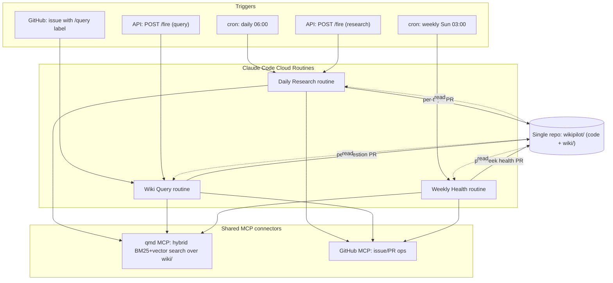
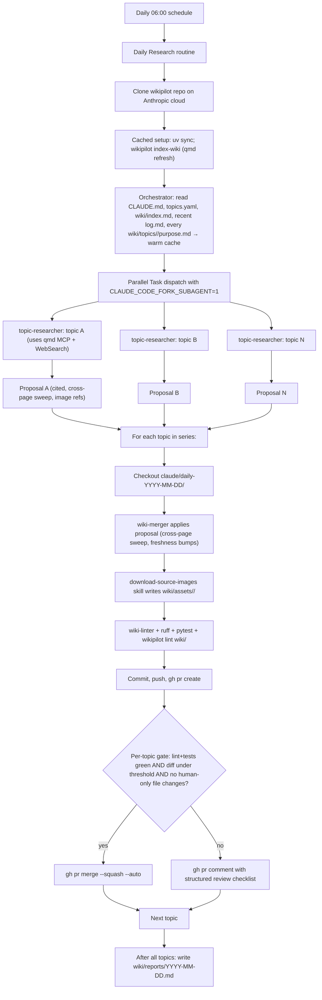

# Architecture

Wikipilot is a single-repo, Obsidian-friendly wiki maintained by three [Claude Code Cloud Routines](https://docs.anthropic.com/en/docs/claude-code/web-scheduled-tasks). All compute happens on Anthropic's infrastructure; Obsidian runs locally over the same git-versioned `wiki/` directory.

## Multi-routine system overview

Three routines share the same repo, the same agents, and the same MCP connectors. Each produces a different shape of PR.



## Daily Research routine: per-topic loop

The most complex of the three. Topic researchers fan out in parallel (sharing the orchestrator's prompt cache via `CLAUDE_CODE_FORK_SUBAGENT=1`), then mergers run in series to produce one PR per topic.



## Repo layout

```text
wikipilot/
├── README.md
├── CLAUDE.md                       # the wiki schema (single source of truth)
├── AGENTS.md                       # pointer to CLAUDE.md for non-Claude tools
├── pyproject.toml                  # uv-managed deps, ruff, pytest config
├── topics.yaml                     # human-owned: list of topics
├── wikipilot.toml                  # human-owned: per-route auto-merge thresholds, image policy
├── .claude/
│   ├── agents/                     # 5 subagent definitions (added in Phase 2)
│   └── skills/                     # 8 skill manifests (added in Phase 2)
├── prompts/                        # 3 routine prompts (added in Phases 4, 6, 7)
├── wiki/                           # the Obsidian vault — content source of truth
│   ├── index.md                    # catalog (LLM-write, human-read)
│   ├── log.md                      # chronological append-only
│   ├── topics/<id>/                # topic landing page + human-owned purpose.md
│   ├── concepts/                   # cross-topic concept pages
│   ├── entities/                   # people/projects/orgs
│   ├── sources/                    # one .md per ingested URL
│   ├── answers/                    # Wiki Query answer pages
│   ├── reports/                    # daily and weekly run reports
│   ├── decks/                      # `wikipilot deck` Marp output
│   └── assets/<source-slug>/       # downloaded images
├── src/wikipilot/                  # Python core
├── scripts/                        # operational scripts
├── tests/                          # pytest suite
└── docs/                           # design docs and runbooks
```

## File ownership matrix

The wiki only stays maintainable if it's clear who owns each file. The Python lint enforces this; the auto-merge gate blocks any `claude/*` branch that touches a human-only file.

- **Human-only**: `topics.yaml`, `CLAUDE.md`, `AGENTS.md`, `wikipilot.toml`, `prompts/`, `wiki/topics/<id>/purpose.md`, `README.md`, `LICENSE`, `.claude/`, `docs/`
- **LLM-only**: `wiki/index.md`, `wiki/log.md`, `wiki/sources/`, `wiki/reports/`, `wiki/answers/`, `wiki/decks/`, `wiki/assets/`
- **Mixed**: `wiki/topics/<id>/index.md`, `wiki/concepts/`, `wiki/entities/`

See [`CLAUDE.md`](../CLAUDE.md) for the full conventions, frontmatter contract, citation discipline, and per-agent model assignments.

## Cost shape

- **Daily Research**: O(topics × Opus_cached_prefix × cache_read_multiplier + topics × Opus_proposal_size + topics × Sonnet_merger + topics × Haiku_lint). Opus pricing on `topic-researcher` dominates. Mitigated by `CLAUDE_CODE_FORK_SUBAGENT=1` (shared cached prefix) and `max_sources_per_run` per topic.
- **Wiki Query**: O(1) per question on Opus.
- **Weekly Health**: O(candidate_sets × pages_per_set) on Sonnet — tunable via `K` in `scripts/disputes_seed.py`.

The per-run report (`wiki/reports/YYYY-MM-DD.md` and `health-YYYY-MM-DD.md`) records token usage by model tier, so we can validate the Opus investment with real numbers after Phase 8.
